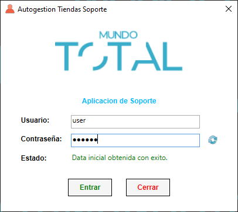
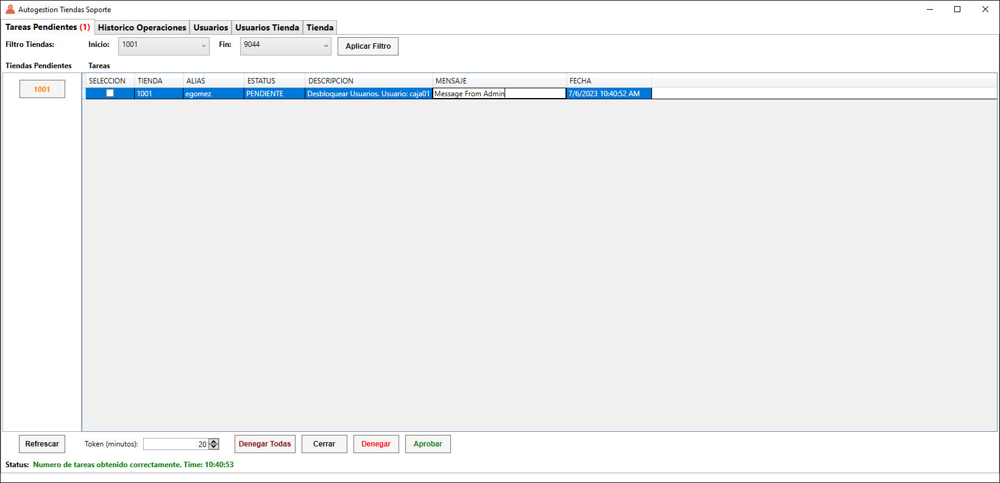
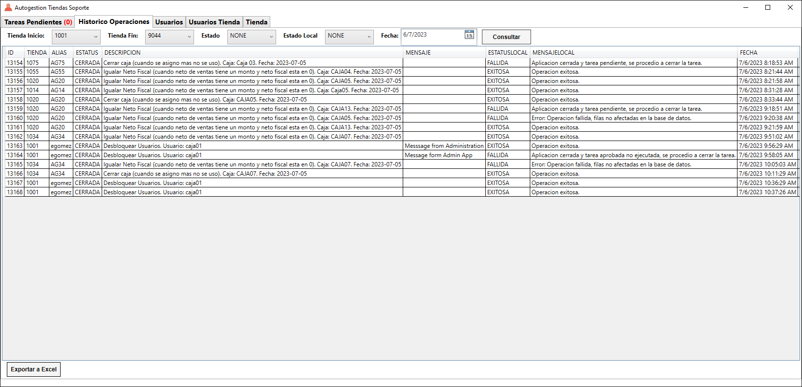
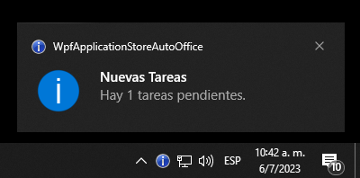

# WpfApplicationStoreAutoOffice

This is the administration application to manage a system of task requests, the administration software is in charge of approving, denying or closing the task. If the task is approved it can be executed in the remote app. The application has alerts in case the task status changes, it also has the ability to send a message from the administration by task status changed.

[WEB SERVICE APPI](https://github.com/aurquiel/WebApplicationStoreAuto)

[STORE APP](https://github.com/aurquiel/WebApplicationStoreAuto)

[SALES APP](https://github.com/aurquiel/WpfApplicationStoreSalePointAuto)

---

## Login

## Main

## Log Task

## Notification Task

